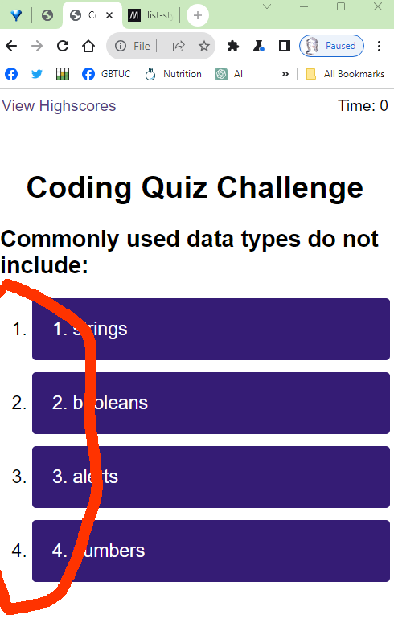

# js-code-quiz
## Module 6 Challenge - Working with Web APIs: Code Quiz

Challenge - build a timed coding quiz with multiple-choice questions which will use dynamically updated HTML and CSS from JavaScript code and have a clean, polished, and responsive user interface.

### Process

* To start, I've created and cloned a GitHub repo, and started writing this README. :ballot_box_with_check:

* As of this Sunday morning (Nov 26), I haven't yet worked out the logic. I think that creating the "building blocks", i.e. the set of questions from the extracted frames of the gif image, might be helpful in doing this.

* As well, I'll set up the file structure, creating a folder and adding 3 js files, and sketching out an initial static html page to determine where the generated pieces will go.

* Hoping that it won't be a time-wasting distraction, I'm going to create some JavaScript snippets for the DOM changing elements, making them as intuitive as possible - https://code.visualstudio.com/docs/editor/userdefinedsnippets.

* I'm also starting the References section, adding one as I go along, along with updating this README file.

* Five sets of questions have been created. TODO: code something to remove/add hide class 

* The removeAttribute() method works - will need to be able to show and hide as part of the logic process.

* For a bit of a change, however, time to fix the button and do some hover effects. 

* Making the start button bigger and bright was easy enough, it was rather involved making the list items look like buttons but I did it eventually. #

* I amended some code that should have been the .after() method (as a sibling) rather than the appendChild() method which inserts an element into another element, not what I wanted in this case.

* Monday morning. For some reason, the ordered list numbers fall outside the buttons. 

TO BE REVISTED: Will try to programmically create them using a css counter with the ::marker pseudo-element -  CSS Lists, Markers, And Counters https://www.smashingmagazine.com/2019/07/css-lists-markers-counters/
  
* Commence the logic bit. Game plan: in logic.js, initiate the quiz and display the first question.

* Successfully coded the first event listener - when start button clicked, the start paragraph and button elements are removed and the first question and choices is displayed. Still some way to go.

* For some reason the question titles need to be in reverse order in the code - otherwise the highest number will appear on the screen (and not be associated with the options)

### Code Logic - What are we trying to do

1. A quiz with a timer
2. The user presses a button to start the quiz.
3. A screen with a question and four possible answers is presented.
4. The user clicks the button that they believe is the answer to each question - the colour of the button changes...
5. The next screen displays, and indicates if the answer was correct or incorrect.
6. After five rounds, the quiz finishes and displays high scores.The user adds their intials, then clears their intials and starts over.

### References

Ode to VSCode Snippets
https://mercedesbernard.com/blog/ode-to-snippets/ 

Node: textContent property
https://developer.mozilla.org/en-US/docs/Web/API/Node/textContent 

Document: createElement() method
https://developer.mozilla.org/en-US/docs/Web/API/Document/createElement 

Node: appendChild() method
https://developer.mozilla.org/en-US/docs/Web/API/Node/appendChild 

Element: setAttribute() method
https://developer.mozilla.org/en-US/docs/Web/API/Element/setAttribute 

HTML DOM Element setAttribute()
https://www.w3schools.com/jsref/met_element_setattribute.asp 

Element: removeAttribute() method
https://developer.mozilla.org/en-US/docs/Web/API/Element/removeAttribute 

Create buttons from UL elements
https://readlearncode.com/code-and-stuff/creating-buttons-from-ul-element/ 

Element: after() method
https://developer.mozilla.org/en-US/docs/Web/API/Element/after 

CSS Lists, Markers, And Counters
https://www.smashingmagazine.com/2019/07/css-lists-markers-counters/ 

